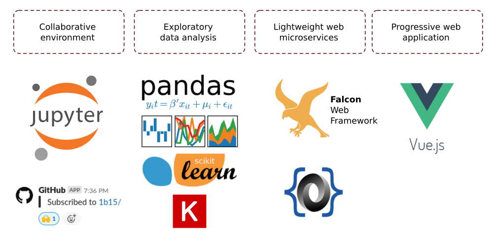

# WalkFlow: Analyzing pedestrian volumes

A project from the [Open Data Hackdays: Tourism](https://opendata.ch/projects/open-data-hackdays/) created on November 29-30, 2019 in Lucerne, Switzerland.

See also our project page at [hack.opendata.ch](https://hack.opendata.ch/project/422)

## The challenge

Imagine you are responsible in the city of Lucerne (or any other Swiss city) to plan for better pedestrian infrastructure and tourism services. For this you need to know how many people walk past specific locations during a day. If you knew which two hours of the day you would need to count to extrapolate the data for the whole day and if you had a tool you could enter this data to automatically get the daily volumes your job would be a lot easier. Maybe the tool would even adjust for the day of the week or weather.

The problem is, at the moment no such tool exists and **we don’t really know which hours are best for doing counts to extrapolate data to the whole day**. Based on data of automatic pedestrian counters in Zurich and Basel, pedestrian flow charts and extrapolation factors could be derived with clever algorithms. This then could be translated into a practical tool for entering the data to easily get results. The challenge is submitted for pedestrian volumes but the same would apply for bicycle data. No such tool exists in Switzerland – neither for walking nor for cycling data.`

## The solution

We gathered some data, cleaned and shaped it, applied statistics and machine learning, and created a very simple web application as proof of concept. High level technical overview:

Our analytical solution can be explored in the [notebooks](notebooks/) folder, while the demo application  deployment instructions can be found in the [walk-api](walk-api/README.md) (backend) and [walk-flow](walk-flow/README.md) (frontend) folders.

### Data sources

| data | source | license |
|------|--------|---------|
| Pedestrian and bicycle countings in Basel | <https://data.bs.ch/explore/dataset/100013/table/> | [Creative Commons CC0](https://creativecommons.org/publicdomain/zero/1.0/) |
| Pedestrian and bicycle countings in Zürich | <https://data.stadt-zuerich.ch/dataset/geo_daten_der_automatischen_fuss__und_velozaehlung> | [Creative Commons CC0](https://creativecommons.org/publicdomain/zero/1.0/) |
| weather (temperature, precipitation, sunshine) | <https://opendata.swiss/de/dataset/automatische-wetterstationen-aktuelle-messwerte> | [Open-BY-ASK](https://opendata.swiss/en/terms-of-use/) |
| holidays | <https://date.nager.at/> | [MIT](https://github.com/tinohager/Nager.Date/blob/master/LICENSE.md) |

## Team

- Justus // [@Jukamala](https://github.com/Jukamala)
- Georg // [@1b15](https://github.com/1b15)
- Laurin // [@1tchy](https://github.com/1tchy)
- Oleg // [@loleg](https://github.com/loleg)
- Daniel Sauter, Urban Mobility Research (Expert)
